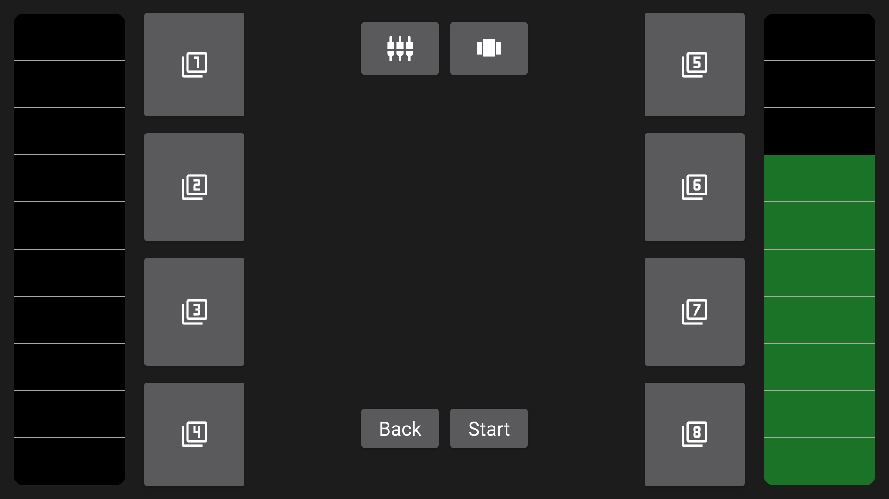
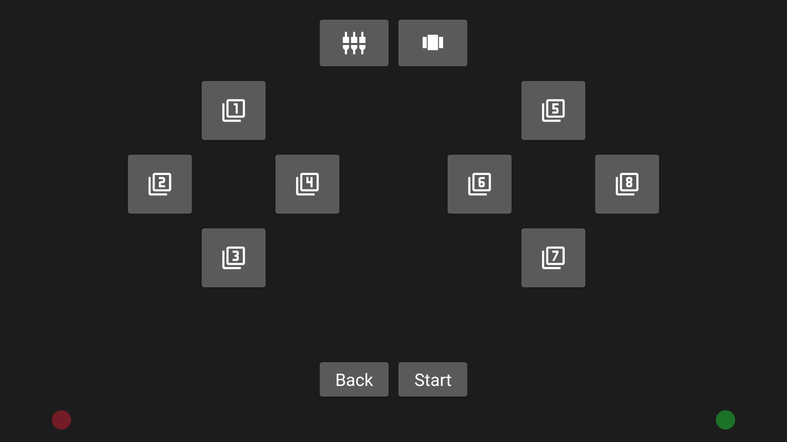
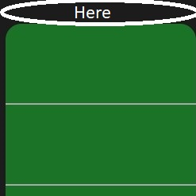

# Remote Wheel

Free way to make your race more than keyboards' ones and zeros!

## Introduction

Project's aim is making a clone of expensive PC racing wheels by using just phone. And making it consistent as real racing wheels as possible.

## Technologies

- Python 3.10
- [vgamepad 0.0.8](https://pypi.org/project/vgamepad/) licensed with MIT License
- B4A 11.50 
- [[B4X] [XUI] AS SectionedSlider v1.00](https://www.b4x.com/android/forum/threads/b4x-xui-as-sectionedslider.137361/) by Alexander Stolte
- [python-uinput 0.11.2](https://pypi.org/project/python-uinput/) licensed with GNU General Public License

## Launch

> For Windows   
> > Step 1  
> Install [Python 3.10](https://www.python.org/downloads/) (if installed before skip to next step). You can also use [PyPy 3.9](https://www.pypy.org/download.html).
> 
> >Step 2  
> Run the following command on command prompt to install required library.  
> `pip install vgamepad`  
> 
> > Step 3  
> Download DesktopClient from [releases page](https://github.com/malisipi/RemoteWheel/releases) to your PC.
> 
> > Step 4  
> Download RemoteWheel from [releases page](https://github.com/malisipi/RemoteWheel/releases) to your phone and set it up.
> 
> > Step 5  
> Run Python code and write shown IP adress to your phone.
> 
> > Step 6  
> "Connected Succesfully" must be appeared then it's finished.  

> For Linux  
> > Step 1  
>  Install [Python 3.10](https://www.python.org/downloads/) (if installed before skip to next step). You can also use [PyPy 3.9](https://www.pypy.org/download.html).
> 
> > Step 2  
> Run on terminal to install required library.  
> `pip install python-uinput`
> 
> > Step 3  
> Download DesktopClient from [releases page](https://github.com/malisipi/RemoteWheel/releases) to your PC.
> 
> > Step 4  
> Run `modprobe uinput` as root on terminal before starting the app on Linux.
>
> > Step 5  
> Download RemoteWheel from [releases page](https://github.com/malisipi/RemoteWheel/releases) to your phone and set it up.
>
> > Step 6  
> Run Python code and write shown IP adress to your phone.
>
> > Step 7  
> "Connected Succesfully" must be appeared then it's finished.  

## Features

Two triggers, ten buttons and one stick which is appointed phone's accelerometer. Detected as a Xbox 360 controller by DesktopClient.

There's two slider and two key placement options:   

> For this one, sliders don't go to zero by themselves and stay at the value last given. Value range is 0-10. And first key placement is this.

> These sliders are resetted when you leave your fingers. And second key placement is this.

> To pass between sliders, use following button:  
  

> To pass between key placements, use following button:  
   

## To Do 

- [ ] Find a solution for high latency. (PyPy may help)

- [ ] When buttons are holded, they gives one and zero for fraction of second and then gives continuous one as they should. But it should give the continuous one from beginning and requires to be fixed.

- [ ] When you touch the tiny spot between above of a slider and screen while slider is all the way up, that slider starts giving value 0.09 which we couldn't understand why. It shouldn't affect it normally and it requires to be fixed.

- [ ] You will probably need to force stop the phone app when it doesn't work or connect. It requires to be fixed.

**All of your bug reports and solutions are needed. We believe that this project has huge potential and we need you to discover it.**